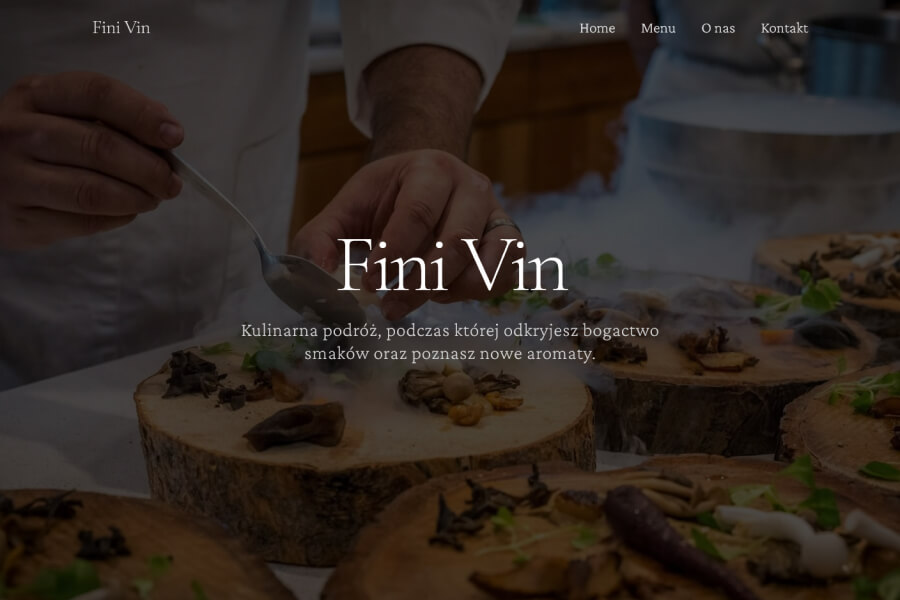

## FiniVin
### Restaurant website template
###### Year: 2025

HTML5 / CSS3 / TAILWIND

**FiniVin -** Restaurant template. In this template Tailwind framework is connected via Play CDN, it is designed for development purposes only, and is not intended for production. With this method you can easily use Tailwind framework.

:poland:
**FiniVin -** Szablon dla restauracji. W tym szablonie framework Tailwind połączony jest przez Play CDN przeznaczony wyłącznie do celów programistycznych i nie jest przeznaczony do produkcji. Dzięki tej motedzie w prosty sposób można używać
framework Tailwind.

### :tada: [Live](https://damiankoduje.pl/templates/finivin)

### Credits:
- [Tailwind](https://tailwindcss.com)
- [Pexels](https://www.pexels.com)
- [Crimson  Pro](https://fonts.google.com/specimen/Crimson+Pro)
- [Cormorant Garamond](https://fonts.google.com/specimen/Cormorant+Garamond)
- [Inter](https://fonts.google.com/specimen/Inter)
- [AOS](https://michalsnik.github.io/aos)
- [GLightbox](https://biati-digital.github.io/glightbox)
- [Swiper](https://swiperjs.com)

### :hand: Template created by [Damiankoduje.pl](https://damiankoduje.pl)